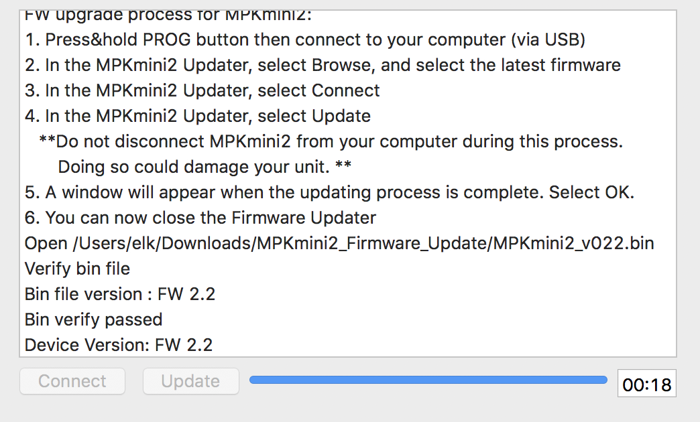
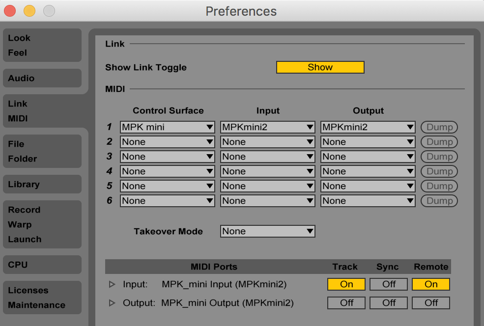

## Music

One of my favorite authors, Kurt Vonnegut, said:

> If I should ever die, God forbid, let this be my epitaph: The only proof he needed for the existence of God was music.

Kurt was a humanist and an atheist, but he still recognized a transcendent power in music. You might feel the same way whether you're religious or not.

Sometimes listening isn't enough, and you just have to make your own sound. That's how I felt over a year ago. It was gnawing away at me, and I simply _had_ to create something. In the digital age, it's not difficult to set up your own space to create the sounds you want.

## Hardware

### MIDI Controllers

A MIDI controller isn't required, but something with a keyboard makes it easier to physically realize the digital creation process.
Don't be overwhelmed by gear, choosing a cheap controller is common advice for entry-level hobbyists.
If you stick with it, you can upgrade later.

#### Picking a controller

For my very first controller, I went with the [Akai MPK Mini MKII](https://www.amazon.com/gp/product/B00IJ6QAO2/). It's a low budget option that's both compact and has a keyboard.

I had some initial apprehensions about a budget controller.
Some folks claimed there was a latency delay, others complain about the software.
I don't use the stock software, and there are easy ways to correct latency issues.
I haven't had any trouble with my choice so far.

There are even some software options available for mobile devices that you might consider like Novation's [Launchpad](https://itunes.apple.com/us/app/launchpad-make-remix-music/id584362474). Some software controllers can link to Ableton.

#### Akai MPK Mini MKII Setup

After you register your controller on the akaipro.com website, you can [download the software](http://www.akaipro.com/account/productreg/products). There aren't drivers that you'll need, but it's a good idea to upgrade the firmware.

<figcaption>Follow the steps to upgrade the firmware</figcaption>

You might be tickling those ivories already, but you won't hear anything until we set up the software.

### Headphones

If you're looking for headphones, [/r/headphones](https://www.reddit.com/r/headphones/) has a very helpful guide [here](https://sites.google.com/view/quipa/assistants) to pick the right equipment. The community there has tailored the selection process according to various consumer needs.

## Software

### Ableton

I've gone with Ableton Live since a few of my friends use it, and they have a great entry-level price. You can [try it](https://www.ableton.com/en/trial/) for a month to see if it's right for you. There are plenty of other music production software options.

#### Controller Setup with Ableton

For the most part, using a controller with Ableton is plug-and-play.
Watch [_Setting Up a MIDI Controller_](https://www.ableton.com/en/live/learn-live/) which will briefly explain the key points to working with a controller in Ableton.

<figcaption>
Setup the controller input from Ableton preferences
</figcaption>

#### Learn Ableton

There are lots of resources for learning Ableton or other music production software.
I recommend Pluralsight and [Coursera](https://www.coursera.org/learn/ableton-live) for their introduction courses.
Coursera is a high-quality free option. Otherwise, YouTube has plenty of tutorials.

### Plugins

There are endless plugins and instruments you can add to the production software. Massive and Battery are popular options, but I recommend sticking with the stock plugins and instruments. Once you're comfortable with what's available, then slowly start to expand.

## Create

For me, creation is cathartic.
Taking on a hobby like this is a marathon, not a sprint.
Mastering a craft takes a long time.
Take the time to learn the tools and explore music theory to understand your own creation process.
Eventually, all the hard work is justified by creativity, and in the end it's worth it.
